

  

# AgroTop
*Projeto final da disciplina de Circuitos Digitais do Instituto de Ciência e Tecnologia da Universidade Federal de São Paulo*
*Relatório Final:* https://github.com/gsfreitas/agrotop/blob/main/Relatorio-AgroTop.pdf
*Arquivos .panda:* https://github.com/gsfreitas/agrotop/blob/main/Sistema%20de%20Irriga%C3%A7%C3%A3o.zip

## Resumo ##
Com a crescente revolução tecnológica voltada para o agronegócio, existe a necessidade do desenvolvimento de sistemas que tornem a atividade braçal automatizada, com a finalidade de garantir a qualidade e tornar o processo mais simples e eficaz. Além disso, esse tipo de tecnologia ajuda a manter a competitividade dentro do mercado do agronegócio. Um dos grandes desafios para a implementação da tecnologia é manter o baixo custo e tornar acessível esse tipo de tecnologia para o uso doméstico. O presente trabalho tem como objetivo desenvolver a lógica de um circuito digital para automatizar a irrigação com base em diferentes tipos de sensores já existentes no mercado. Além disso, busca estar de acordo com o objetivo 2 e 6 dos Objetivos de Desenvolvimento Sustentável da ONU (Organização das Nações Unidas), que são fome zero e agricultura sustentável e água potável e saneamento.

## Abstract ##
Abstract —  With the growing technological revolution focused on agribusiness, there is a need to develop systems that make manual activity automated, in order to guarantee quality and make the process simpler and more effective. In addition, this type of technology helps maintain competitiveness within the agribusiness market. One of the great challenges for the implementation of the technology is to keep the cost low and make this type of technology accessible for domestic use. This work aims to develop the logic of a digital circuit to automate irrigation based on different types of sensors already on the market. In addition, it seeks to comply with objective 2, 3 and 7 of the Sustainable Development Goals of the UN (United Nations), which are zero hunger; good health and well-being; and affordable and clean energy respectively.

## I - INTRODUÇÃO ##
### Contextualização ###
A horta caseira tem se tornado uma alternativa para muitos brasileiros como forma de manter uma alimentação saudável perante o hábito de se alimentar fora de casa. Sabendo que a alimentação saudável gera qualidade de vida, se faz necessário que as pessoas administrem o horário de maneira organizada para otimizar o tempo e conciliar com as atividades do dia a dia.

Segundo o Programa de Análise de Resíduos em Alimentos da ANVISA (Agência Nacional de Vigilância Sanitária, 2011), um terço dos alimentos consumidos pelos brasileiros possuem agrotóxicos. A intoxicação por esse produto químico pode causar diversas doenças, como as variações do câncer. Esse é um dos motivos pelos quais as pessoas buscam pela qualidade de vida através de uma alimentação saudável.

  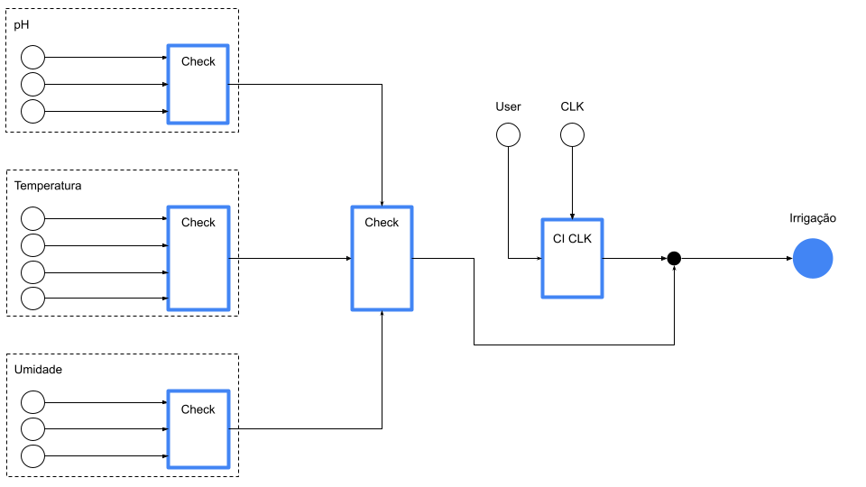
    Figura 4: Funcionamento do circuito

Os dados são lidos pelos respectivos sensores de temperatura, pH e umidade. O primeiro bloco verificador irá avaliar se um desses sensores estão com valores divergentes e aponta qual deles apresenta um possível problema. Antes de ativar o sistema de irrigação ele irá verificar se ao menos dois sensores estão na faixa de valores correta para ativação. Em caso positivo, a válvula de irrigação será ativado e apontará qual das categorias de sensores (temperatura, pH ou umidade) está com valor divergente. Ele ficará ativado por 12 segundos e em seguida terá 1 segundo para avaliar novamente os parâmetros para irrigar novamente ou não. O usuário também poderá fazer intervenção de forma manual, ligando ou desligando a válvula de irrigação

### Necessidade da automação ###
Muitos brasileiros possuem uma rotina completa de demandas e falta de tempo, seja por conta do trabalho ou por questões pessoais. Administrar a rotina e incorporar as práticas de exercício físico ou outras que auxiliem a melhorar a qualidade de vida se tornou cada vez mais complexo.

Dado um dos principais problemas latentes de muitas pessoas em lidar com essa gestão do tempo para conciliar as demandas, se faz necessário o uso de recursos tecnológicos para auxiliá-las a investir melhor o tempo e tornar o dia a dia mais eficaz e produtivo. 

### Principais desafios ###
À medida que novas tecnologias emergem para tentar facilitar as demandas do cotidiano, seja para as pessoas ou para negócios, independente do tamanho, o grande desafio é dar acessibilidade ao usuário final. Isso exige que o produto tenha um baixo custo e se adapte melhor às necessidades do consumidor, por exemplo.

Com o presente trabalho, o objetivo é além de desenvolver um produto de baixo custo, uma vez que a lógica é desenvolvida com sensores já existentes no mercado, mas também possibilitar a autonomia para o usuário e fazer com que sua rotina seja mais eficaz. Isso é possível com a automação da irrigação de uma horta.

## II - SENSORES ##
### pH - Potencial Hidrogeniônico ###
O sensor de pH é um dos sensores envolvidos no projeto. Ele tem como finalidade medir o nível de acidez ou alcalinidade de uma solução. É amplamente utilizado em laboratórios, processos industriais e aplicações ambientais para monitorar e controlar a qualidade de líquidos, como água, alimentos e produtos químicos. O sensor de pH fornece informações importantes para garantir a segurança, eficiência e precisão em uma variedade de processos e aplicações.

  
    Figura 2: Sensor de pH

No presente projeto, ele será utilizado para verificar a acidez ou alcalinidade na solução. Uma vez que as plantas em geral possuem o seu desenvolvimento máximo entre um pH de 5,5 e 6,5 e à medida que elas crescem esse valor pode ser alterado (SOUZA, Silva Allef, 2016).

A lógica utilizada para este sensor é baseada nos valores considerados ideais. Caso o pH esteja abaixo de 5,5, o sensor então é ajustado com solução alcalina.

Para aumentar a precisão do sistema, será utilizado uma lógica de verificação par a par entre todos os sensores. Para fins de simplificação do projeto, os valores foram arredondados e a tabela verdade do circuito pode ser observada na Figura 2.

A simplificação para cada saída foi feita através do mapa de Karnaugh, ou mais comumente denominado mapa-K.

|        |             |
| :-----------------------------------:    | :-----------------------------------: |
| Figura 3: Tabela verdade sensor pH       |  Figura 4: Mapa-K pH                  |

É possível simplificar a saídas dado o mapa de Karnaugh e pode ser observada através da expressão a seguir:

  *S' = C' + B'A'*

### Umidade e temperatura ###

O sensor de temperatura é ideal para alertar o usuário quando o valor não estiver dentro das normalidades. O valor considerado padrão para uma horta é acima de 18°C e abaixo de 24°C no verão e 10°C a 16°C durante o inverno, uma vez que temperaturas acima do limiar máximo podem causar danos às plantas, pois elas apresentam dificuldades em realizar fotossíntese e garantir os nutrientes em temperaturas extremamente altas.

Já o sensor de umidade é útil para monitorar a quantidade de água no solo, permitindo que o usuário saiba o momento de regar as plantas, evitando o excesso ou a falta de água. O sensor auxilia o uso consciente da água e garante a umidade adequada para o crescimento saudável das plantas.

Além disso, esse tipo de dispositivo também ajuda a evitar o apodrecimento das raízes devido a falta de irrigação.

  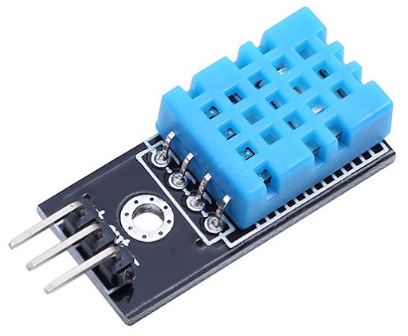
    Figura 4: Sensor de Umidade e Temperatura

A umidade ideal para uma horta caseira varia de 50% até uma média de 75%. Essa faixa de valores será usada para o desenvolvimento do sensor posteriormente, respeitando os limites do dispositivo físico, que variam de 20% a 90% para o sensor de umidade e até 50°C para a leitura de temperatura.

A lógica para ambos os dispositivos é trabalhar em faixa de valores para 3 bits para o sensor de umidade e com a finalidade de aumentar a precisão no sensor de temperatura, serão utilizados 4 bits. A tabela verdade para o sensor de umidade e temperatura podem ser analisadas respectivamente nas Figuras 5 e 6.

| 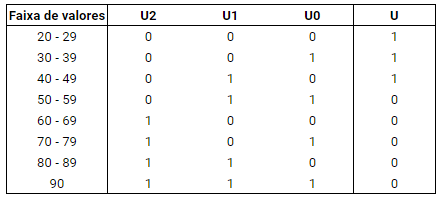  | 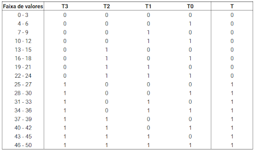   |
| :-----------------------------------:    | :-----------------------------------:         |
| Figura 5: Tabela verdade sensor umidade  |  Figura 6: Tabela verdade sensor temperatura  |

A partir das tabelas-verdade anteriores é possível analisar o momento de ativação para cada tipo de leitura. No caso de umidade, é ativo somente quando o valor mensurado é menor que 20% e o usuário precisa regar as plantas novamente. Já para o caso de temperatura, o usuário será avisado tanto no momento em que a temperatura exceder os valores máximos considerados ideais para as plantas, quanto para os valores mínimos ideais para manter sua sobrevivência.

Antes de elaborar o diagrama do circuito, é importante simplificar cada um deles. Para ambos os casos, foi utilizado o mapa de Karnaugh para auxiliar o processo e então a equação que irá modelar o circuito. Ambos podem ser verificados a seguir.

| 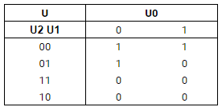  | 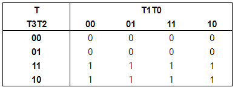           |
| :-----------------------------------:    | :-----------------------------------: |
| Figura 7: Mapa-K sensor umidade          |  Figura 8: Mapa-K sensor temperatura  |

*T = T3*
*U = U2'U0' + U2'U1'*
### Verificador par a par ###

Para garantir que os sensores estejam funcionando corretamente e detecte alguma anomalia na leitura, será utilizada uma lógica, para cada sensor, a fim de verificar se ao menos dois deles estejam funcionando corretamente. Um alarme irá detectar qual o sensor que apresenta um potencial erro de leitura em uma de suas saídas. Um display de 7 segmentos irá indicar qual dos circuitos se mostrou menos preciso durante a leitura.

O circuito verificador foi desenvolvido de forma genérica, ou seja, um circuito integrado para facilitar a replicação posteriormente.

  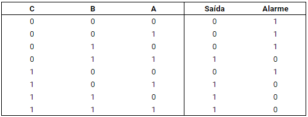
    Figura 9: Tabela verdade verificador

  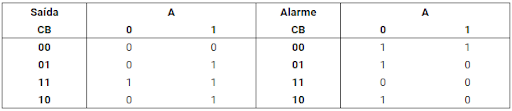
    Figura 10: Mapa-K verificador

Simplificando a partir do mapa demonstrado na Figura 15, obtemos as seguintes expressões:

*Saída = BA + CA + CB = A(B+C) + CB*

*Alarme = B'A' + C'B' + C'A' = A'(B'+C') + C'B'*

### Display de 7 Segmentos ###

Para facilitar a manutenção e acurácia da automação, o display de 7 segmentos foi introduzido a fim de sinalizar qual dos sensores pode estar apresentando erros de leitura.

| 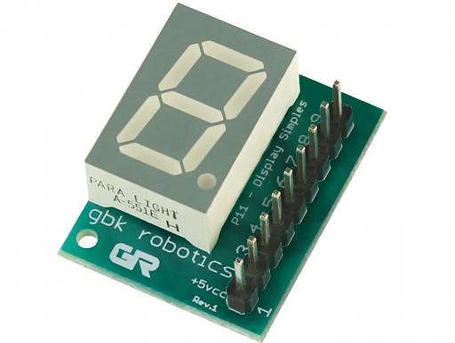            | 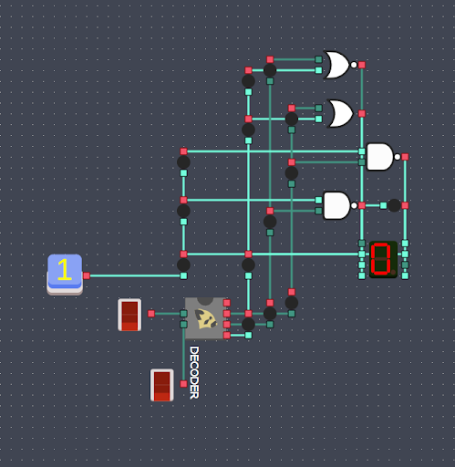                |
| :-----------------------------------:     | :-----------------------------------:   |
| Figura 11: Display de 7 segmentos          |  Figura 12: Representação do display   |

## Representação do circuito ##

O circuito completo pode ser observado logo abaixo com os respectivos sensores (temperatura, pH e umidade), juntamente com o CI do clock e verificador.

  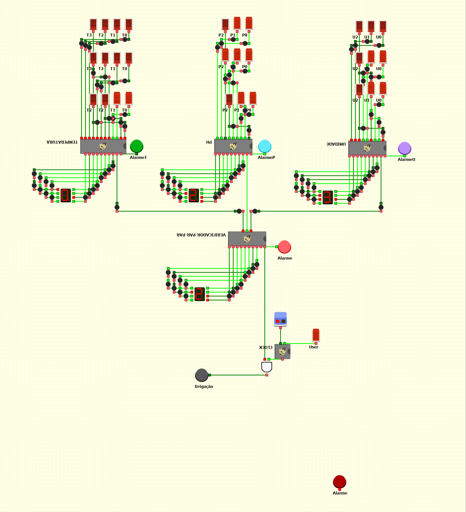
    Figura 13: Sistema de irrigação completo

Na figura acima, os sensores de temperatura e umidade não estão na faixa de valores correta para ativação do circuito, ou seja, a temperatura não está acima de 25°C e o sensor de umidade está acima de 50%. O circuito verificador já foi capaz de detectar entre cada sensor qual deles está divergente dos demais. O segundo verificador só é ativado quando há ao menos duas entradas nível alta, mas neste caso apenas o pH. Como a entrada do usuário está habilitada, então a válvula de irrigação não é ativada.

## Conclusão ##

Em conclusão, um sistema de irrigação automático com sensores é altamente benéfico. Esse tipo de sistema proporciona uma gestão eficiente do uso de água, garantindo que as plantas recebam a quantidade adequada de irrigação no momento certo. Os sensores monitoram constantemente as condições do solo, como umidade e pH. Além disso, um sistema automatizado economiza tempo e esforço, eliminando a necessidade de monitoramento manual constante. Com a capacidade de otimizar o consumo de água e melhorar o crescimento das plantas, um sistema de irrigação automático com sensores se mostra uma escolha inteligente e sustentável para um manejo eficaz da água e uma paisagem verde exuberante. Além disso, é um sistema que contribui para os Objetivos de Desenvolvimento Sustentável da ONU, contribuindo especificamente para uma gestão eficiente do uso da água e fome zero e agricultura sustentável.

## Referências ##
[1] ANVISA. Programa de Análise de Resíduo de Agrotóxico em Alimentos (PARA), dados da coleta e análise de alimentos de 2010. Brasília: ANVISA, 2011. Disponível em: www.anvisa.gov.br. Acesso em 06 de junho de 2023.

[2] DOS SANTOS ASSAD, ÉRIKA; NOVAES PILLAR DE OLIVEIRA CASTRO, L.; TAVARES MOTA, L. E.; DE JESUS SOUZA, M.; DE PAULA SILVA DE CARVALHO, M. Protótipo para instalação de um sistema para controle de irrigação de hortas caseiras: easy garden uma solução sustentável. Humanas Sociais & Aplicadas, v. 9, n. 26, p. 8-17, 19 dez. 2019.

[3] TUDO Hidroponia. (s.d.). Cuidados com a solução nutritiva
para Hidroponia. Tudo Hidroponia. Disponível em: http://tudohidroponia.net/cuidados-com-a-solucaonutritiva-para-hidroponia/. Acesso em 26 de Junho de 2023. 

[4] SOUZA, Allef Silva; LOURENÇO, Ícaro Lopes; PEREIRA, Laiane dos Santos; SANTOS, Marcos Galdino. Horta hidropônica automatizada por microcontrolador. Disponível em: http://sistemaolimpo.org/midias/uploads/041a39b02a1a5bb1d271f19551ba9396.pdf. Acesso em 25 de Junho de 2023.

[5] MARCUSSE, Carolina. Ter uma horta caseira é opção saudável e útil para toda família. Correio Braziliense, São Paulo, 01 de agosto de 2023. Disponível em: https://www.correiobraziliense.com.br/revista-do-correio/2022/07/5024821-ter-uma-horta-caseira-e-opcao-saudavel-e-util-para-toda-a-familia.html. Acesso em: 15 de junho de 2023.
