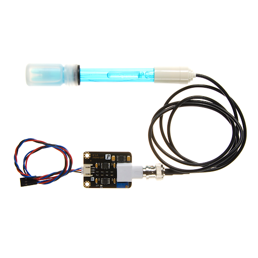
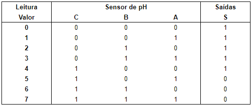
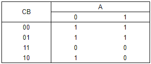

  

# AgroTop
*Projeto final da disciplina de Circuitos Digitais do Instituto de Ciência e Tecnologia da Universidade Federal de São Paulo*

## Resumo ##
Com a crescente revolução tecnológica voltada para o agronegócio, existe a necessidade do desenvolvimento de sistemas que tornem a atividade braçal automatizada, com a finalidade de garantir a qualidade e tornar o processo mais simples e eficaz. Além disso, esse tipo de tecnologia ajuda a manter a competitividade dentro do mercado do agronegócio. Um dos grandes desafios para a implementação da tecnologia é manter o baixo custo e tornar acessível esse tipo de tecnologia para o uso doméstico. O presente trabalho tem como objetivo desenvolver a lógica de um circuito digital para automatizar a irrigação com base em diferentes tipos de sensores já existentes no mercado. Além disso, busca estar de acordo com o objetivo 2, 3 e 7 dos Objetivos de Desenvolvimento Sustentável da ONU (Organização das Nações Unidas), que são fome zero; boa saúde e bem estar; e energia acessível e limpa respectivamente.

## Abstract ##
Abstract —  With the growing technological revolution focused on agribusiness, there is a need to develop systems that make manual activity automated, in order to guarantee quality and make the process simpler and more effective. In addition, this type of technology helps maintain competitiveness within the agribusiness market. One of the great challenges for the implementation of the technology is to keep the cost low and make this type of technology accessible for domestic use. This work aims to develop the logic of a digital circuit to automate irrigation based on different types of sensors already on the market. In addition, it seeks to comply with objective 2, 3 and 7 of the Sustainable Development Goals of the UN (United Nations), which are zero hunger; good health and well-being; and affordable and clean energy respectively.

## I - INTRODUÇÃO ##
### Contextualização ###
A horta caseira tem se tornado uma alternativa para muitos brasileiros como forma de manter uma alimentação saudável perante o hábito de se alimentar fora de casa. Sabendo que a alimentação saudável gera qualidade de vida, se faz necessário que as pessoas administrem o horário de maneira organizada para otimizar o tempo e conciliar com as atividades do dia a dia.

Segundo o Programa de Análise de Resíduos em Alimentos da ANVISA (Agência Nacional de Vigilância Sanitária, 2011), um terço dos alimentos consumidos pelos brasileiros possuem agrotóxicos. A intoxicação por esse produto químico pode causar diversas doenças, como as variações do câncer. Esse é um dos motivos pelos quais as pessoas buscam pela qualidade de vida através de uma alimentação saudável.

### Necessidade da automação ###
Muitos brasileiros possuem uma rotina completa de demandas e falta de tempo, seja por conta do trabalho ou por questões pessoais. Administrar a rotina e incorporar as práticas de exercício físico ou outras que auxiliem a melhorar a qualidade de vida se tornou cada vez mais complexo.

Dado um dos principais problemas latentes de muitas pessoas em lidar com essa gestão do tempo para conciliar as demandas, se faz necessário o uso de recursos tecnológicos para auxiliá-las a investir melhor o tempo e tornar o dia a dia mais eficaz e produtivo. 

### Principais desafios ###
À medida que novas tecnologias emergem para tentar facilitar as demandas do cotidiano, seja para as pessoas ou para negócios, independente do tamanho, o grande desafio é dar acessibilidade ao usuário final. Isso exige que o produto tenha um baixo custo e se adapte melhor às necessidades do consumidor, por exemplo.

Com o presente trabalho, o objetivo é além de desenvolver um produto de baixo custo, uma vez que a lógica é desenvolvida com sensores já existentes no mercado, mas também possibilitar a autonomia para o usuário e fazer com que sua rotina seja mais eficaz. Isso é possível com a automação da irrigação de uma horta.

## II - SENSORES ##
### pH - Potencial Hidrogeniônico ###
O sensor de pH é um dos sensores envolvidos no projeto. Ele tem como finalidade medir o nível de acidez ou alcalinidade de uma solução. É amplamente utilizado em laboratórios, processos industriais e aplicações ambientais para monitorar e controlar a qualidade de líquidos, como água, alimentos e produtos químicos. O sensor de pH fornece informações importantes para garantir a segurança, eficiência e precisão em uma variedade de processos e aplicações.

  

No presente projeto, ele será utilizado para verificar a acidez ou alcalinidade na solução. Uma vez que as plantas em geral possuem o seu desenvolvimento máximo entre um pH de 5,5 e 6,5 e à medida que elas crescem esse valor pode ser alterado (SOUZA, Silva Allef, 2016).

A lógica utilizada para este sensor é baseada nos valores considerados ideais. Caso o pH esteja abaixo de 5,5, o sensor então é ajustado com solução alcalina.

Para aumentar a precisão do sistema, será utilizado uma lógica de verificação par a par entre todos os sensores. Para fins de simplificação do projeto, os valores foram arredondados e a tabela verdade do circuito pode ser observada na Figura 2.

A simplificação para cada saída foi feita através do mapa de Karnaugh, ou mais comumente denominado mapa-K. A simplificação para a saída de base e ácido pode ser observada na Figura 3.

  
  

